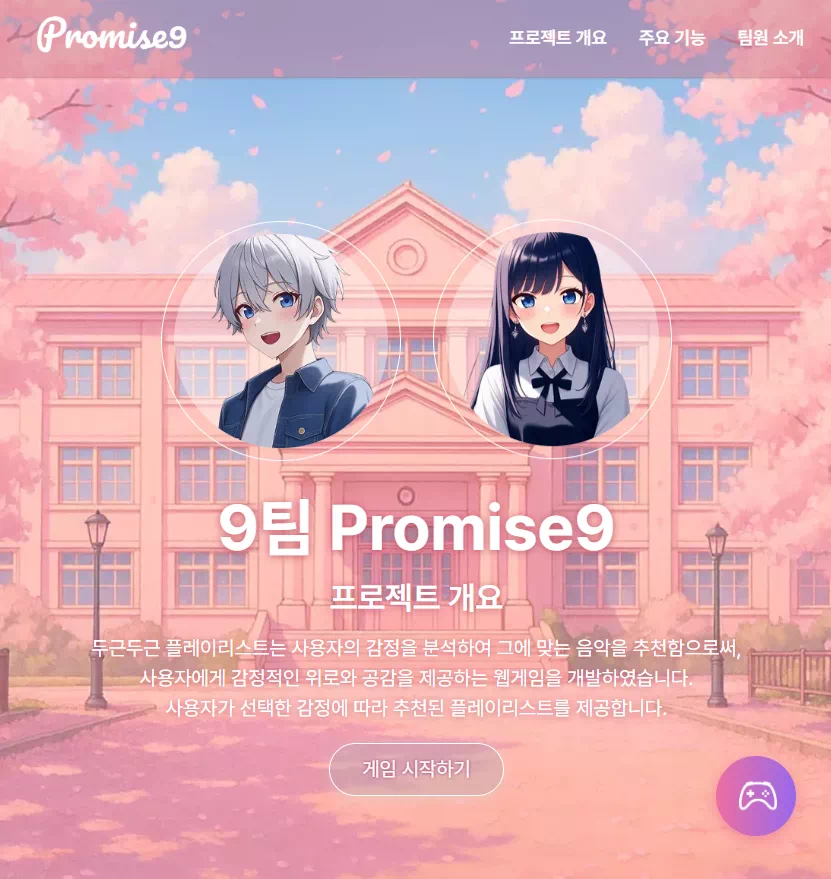
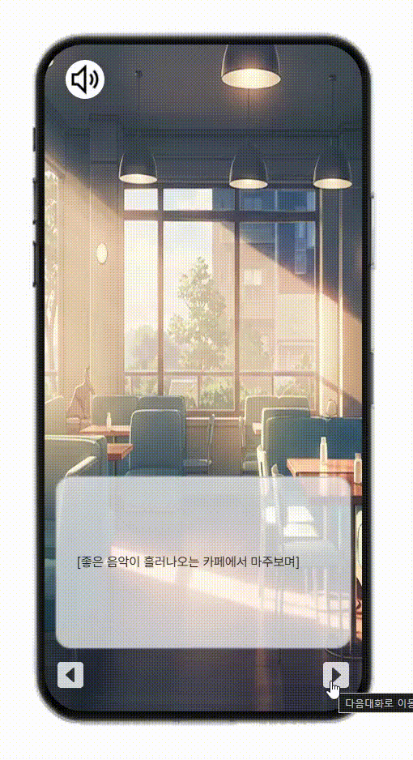
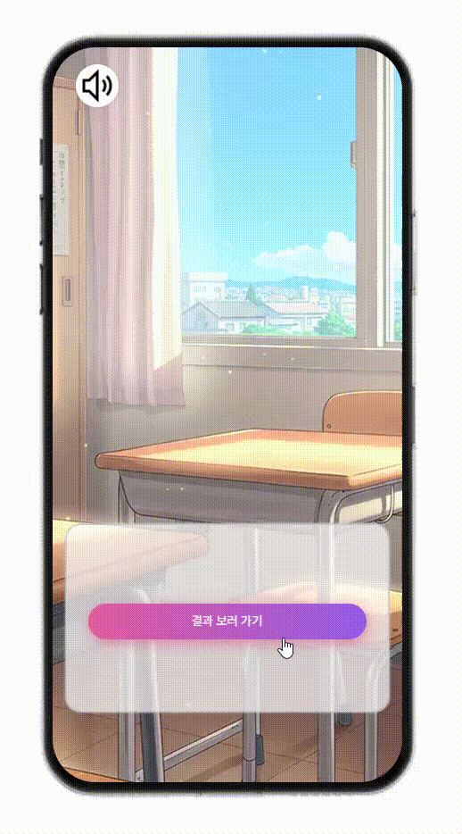
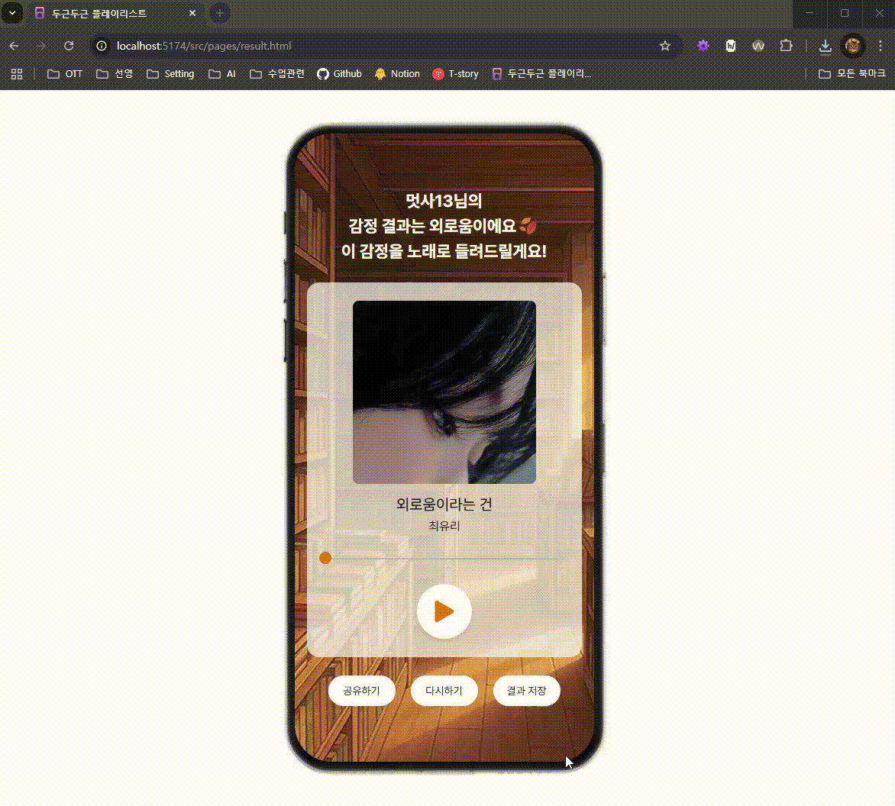
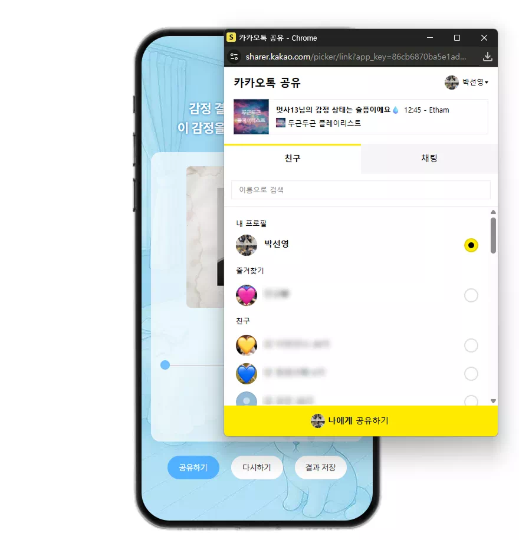
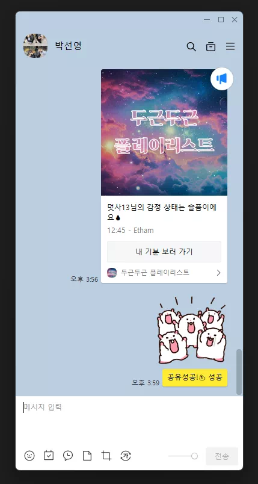

<div align="center">
<h1 align="center">멋쟁이 사자처럼 JS 프로젝트✨ <br> 9팀 Promise9 💝</h1>
<a href="https://dokidoki-playlists.netlify.app/" target="_blank" title="두근두근 플레이리스트로 이동">
  
</a>
  
🔗 [ 💝 두근두근 플레이리스트 💝 바로가기](https://dokidoki-playlists.netlify.app/)
</div>


<br><br>

<div align="center">

## TEAM MEMBERS 🧑‍💻

|       |        |          |    |
| :----------------------------------------------------------------------------------------------------------------------------------: | :-----------------------------------------------------------------------------------------------------------------------------------: | :-------------------------------------------------------------------------------------------------------------------------------------: | :-------------------------------------------------------------------------------------------------------------------------------: |
|                                                              **박선영**                                                              |                                                              **배샛별**                                                               |                                                               **이진현**                                                                |                                                            **최승진**                                                             |
|                                                          PM / Scrum Master                                                           |                                                             QA / 문서관리                                                             |                                                                   PL                                                                    |                                                            QA / 디자인                                                            |
| [](https://github.com/seonyoungg) | [](https://github.com/Stella97415) | [](https://github.com/imnotpossib1e) | [](https://github.com/apppiel) |

<br><br>

## PROJECT DURATION 📆

2025.05.09 ~ 2025.05.23
<br><br>

## PROJECT OVERVIEW 📑

📌**프로젝트 이름**

🎵 두근두근 플레이리스트 🎵
<br><br>

📌**프로젝트 목적**

사용자의 감정을 분석하여 그에 맞는 음악을 추천함으로써,  
사용자에게 감정적인 위로와 공감을 제공하는 웹게임을 개발합니다.
<br><br>

📌**주요 기능**

**✅ 감정 분석 및 대화 분기 시스템**  
사용자 선택에 따라 대화 흐름이 분기되는 브랜칭 시스템을 통해, 다양한
감정과 상황에 맞는 시나리오를 제공합니다.

**✅ 감정 결과 판별**  
사용자의 선택에 따라 감정을 판별합니다.

**✅ 음악 추천**  
분석된 감정에 맞는 음악을 추천하고 재생합니다.

**✅ 감정 결과 공유**  
감정 결과 화면을 이미지로 저장하거나 카카오톡으로 공유할 수 있어, 다른 사람들과
쉽게 결과를 나눌 수 있습니다.
<br><br>

**🌟 기대 효과**  
1️. 사용자에게 감정에 맞는 음악을 제공하여 정서적 안정과 공감을 유도합니다.  
2️. 프론트엔드 기술을 활용한 프로젝트 경험을 통해 팀원들의 역량을 강화합니다.
<br><br>

## TOOLS 🔧

| 구분                  | 기술 / 도구                                                                                                                                                                                                                                                                                                                                                                                                                            |
| --------------------- | -------------------------------------------------------------------------------------------------------------------------------------------------------------------------------------------------------------------------------------------------------------------------------------------------------------------------------------------------------------------------------------------------------------------------------------- |
| **프론트엔드 기술**   |     |
| **개발 도구**         |                                                                                                                                                                                            |
| **버전 관리 및 협업** |                                                                                                                                                                                                                                       |
| **커뮤니케이션 도구** |                                                                                                                     |
| **배포**              | |

<br><br>

## PROJECT STRUCTURE 📁

</div>

```
📂📂Promise9
├── 📂assets/
├── 📂public/
│   ├── 📂assets/
│   │   └── 📂img/
│   ├── 📂bgm/
│   └── 📂fonts/
├── 📂src/
│   ├── 📂components/
│   ├── 📂css/
│   ├── 📂js/
│   ├── 📂pages/
│   ├── 📄main.ts
│   ├── 📄style.css
│   └── ⚙️vite-env.d.ts
├── 📄index.html
├── 📄.gitignore
├── ⚙️eslint.config.js
├── ⚙️prettier.config.js
├── ⚙️package-lock.json
├── ⚙️package.json
├── ⚙️vite.config.js
└── 📄README.md
```
<br><br>
<div align="center">
  
## PROJECT PREVIEW 🖥️

#### 1. 로컬스토리지 기반 데이터 활용

사용자의 이름 및 게임 데이터를 로컬스토리지에 저장하여, 게임의 몰입감을 높이고, 게임 중간에 브라우저를 종료해도 다시 접속 시 이어서 진행할 수 있도록 구현하였습니다.

  

#### 2. 감정 분석 및 대화 분기 시스템

사용자 선택에 따라 대화 흐름이 분기되는 브랜칭 시스템을 통해, 다양한 감정과 상황에 맞는 시나리오를 제공합니다.

  

#### 3. 감정 점수 기반 음악 추천

저장된 감정 점수 중 가장 높은 값을 기준으로 해당 감정에 맞는 플레이리스트 배열 중 하나를 무작위로 추천합니다.

  

#### 4. 음악 재생 제어 기능

음악 재생 시, 프로그레스바를 클릭하거나 드래그하여 원하는 재생 위치로 이동할 수 있도록 하여 유동적인 음악 감상이 가능합니다.

  

#### 5. 추천 결과 공유 기능

추천 결과 화면을 이미지로 저장하거나 링크로 공유할 수 있어, 다른 사람들과 쉽게 결과를 나눌 수 있습니다.

  

  <div style="display:flex; gap:0.5rem; align-items:center;">
    
  
  </div>
</div>
